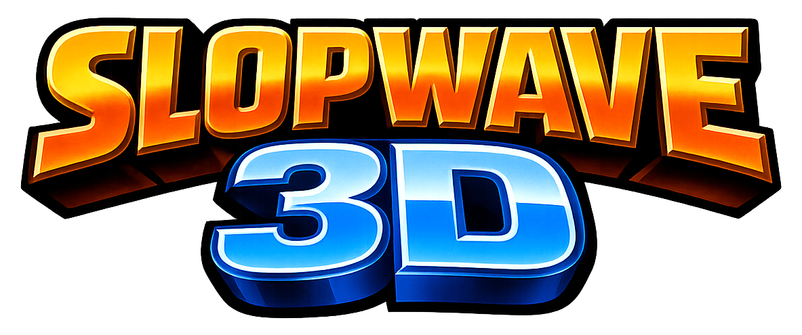
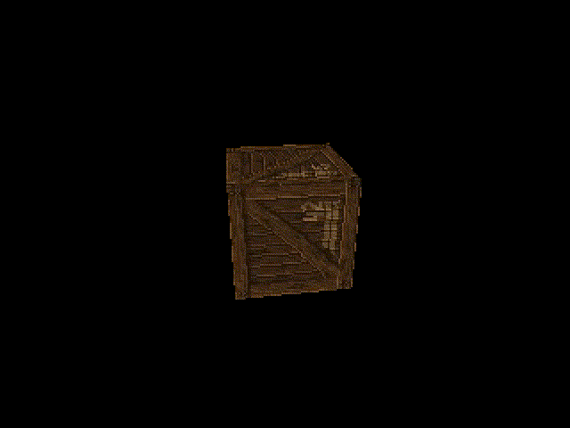

<p align="center">

</p>

<p align="center">
<a href="https://github.com/qwibitai/nanoclaw/tree/main/repo-tokens"></a>
</p>

<p align="center">

</p>

A 3D game engine for people who think graphics peaked in 2002.

**slopwave3d** (slop3d) is a software rasterizer built in C that compiles to WebAssembly — no GPU, no shaders, no excuses. It renders at 320x240 with 128x128 JPG textures, affine texture mapping, and Gouraud shading. Every visual "flaw" is intentional.

This is what happens when you build a 3D engine that fits in a single AI context window and refuses to look good.

## The Aesthetic

Remember Shockwave 3D? LEGO Backlot? Those weird browser games that ran in a 400px window and looked like a PlayStation had a fever dream? That's what we're going for.

- **Affine texture warping** — textures wobble and stretch on large polygons because we don't do perspective correction. This was characteristic of early 2000s software rasterizers, and Shockwave 3D's software fallback path likely exhibited the same behavior.
- **Gouraud shading** — lighting computed at vertices, interpolated across faces. Smooth gradients with Mach banding artifacts. This was Shockwave 3D's standard shading model for its `#standard` shader, used by the vast majority of Shockwave 3D content.
- **16-bit Z-buffer** — co-planar surfaces fight for their lives. Z-fighting isn't a bug, it's a feature.
- **Nearest-neighbor filtering** — pixels are chunky. Textures are crunchy. The year is 2002 and we are free.
- **320x240** — scaled up to your display with `image-rendering: pixelated`. Every pixel visible. Every pixel earned.

## Architecture

```
┌─────────────────────────┐
│  Your Game (SlopScript)  │
├─────────────────────────┤
│  slop3d.js (API + DSL)  │
├─────────────────────────┤
│  WASM (Emscripten)      │
├─────────────────────────┤
│  slop3d.c (C Core)      │
└─────────────────────────┘
```

This mirrors how Shockwave 3D actually worked: a compiled engine (Intel's Internet 3D Graphics software, internally known as the IFX Toolkit) with a scripting layer on top (Lingo). Here, C is the engine and SlopScript is the scripting language — a purpose-built DSL that transpiles to JS in the browser.

## Specs

| | |
| --- | --- |
| Resolution | 320x240 |
| Textures | 128x128 max, JPG only, nearest-neighbor |
| Shading | Gouraud (vertex-lit) |
| Texture Mapping | Affine (no perspective correction) |
| Z-Buffer | 16-bit |
| Lights | 8 slots: ambient, directional, point, spot |
| Fog | Linear |
| Max Textures | 64 |
| Max Meshes | 128 |
| Max Objects | 256 |
| Poly Budget | ~10,000 per scene |
| Total Engine Size | ~2,700 lines (C) + ~1,200 lines (JS + SlopScript) |

## Build

### WASM (modern browsers)

**Prerequisites:** [Emscripten](https://emscripten.org/docs/getting_started/downloads.html) (`emcc` in PATH), a C compiler for tests, optionally [Prettier](https://prettier.io/) and Python 3.

```bash
make          # Build WASM output (web/slop3d_wasm.js + .wasm)
make serve    # Build + start local server on http://localhost:8080
make test     # Run C + JS unit tests
make fmt      # Auto-format C (clang-format) and JS (prettier)
make clean    # Remove all build outputs
```

After building, open `http://localhost:8080/web/index.html` in a browser.

## Quick Start

Games are written in **SlopScript**, a minimal DSL with no boilerplate:

```
assets
    model cube = cube.obj
    skin crate = crate.jpg

scene main
    box = spawn: cube, crate
    camera.position = 0, 1.5, 5

    update
        box.rotation.y = t * 30
```

Load it in HTML with a single script tag:

```html
<script src="slop3d_wasm.js"></script>
<script src="slop3d.js"></script>
<script type="text/slopscript" src="demo.slop"></script>
```

Or write inline — no build step, no bundler, no quotes, no semicolons, no parentheses.

### SlopScript Features

- **Indentation-based** syntax, no braces or semicolons
- **No parentheses** — `sin[t]` for calls, `[a + b]` for grouping
- **Reactive properties** — `box.rotation.y = t * 30` directly drives the engine
- **Degree-based trig** — `sin[]`, `cos[]`, `tan[]` all take degrees
- **Named scenes** with `goto:` for transitions and auto-cleanup
- **Built-in `t`** (elapsed seconds) and **`dt`** (delta time)
- Control flow: `if`/`elif`/`else`, `while`, `for/in`, `fn`, `return`

You can also use the JS API directly if you prefer — see [`js/slop3d.js`](js/slop3d.js) for the `Slop3D` class.

## Why?

- The entire engine fits in an AI context window (~20K tokens). Every line is visible, every function is reachable.
- No build complexity. One C file, one JS file, one `make` command.
- Shockwave 3D died in 2019. This is its ghost, haunting your browser.
- Sometimes you don't want 4K ray-traced reflections. Sometimes you want 128 pixels of a crate texture wobbling on a polygon.

## Development

This engine is being built incrementally and publicly with AI coding agents, following a [deliberate development philosophy](CONTRIBUTING.md) — one issue at a time, read every line, no rushing.

Each development session is documented in [`docs/sessions/`](docs/sessions/) with full conversation logs, research citations, and decision rationale. Progress is tracked through [GitHub Issues](https://github.com/deadcast2/slopwave3d/issues).

## Credits

- Token count badge by [qwibitai/nanoclaw](https://github.com/qwibitai/nanoclaw/tree/main/repo-tokens)

## License

[Unlicense](LICENSE) (public domain)
